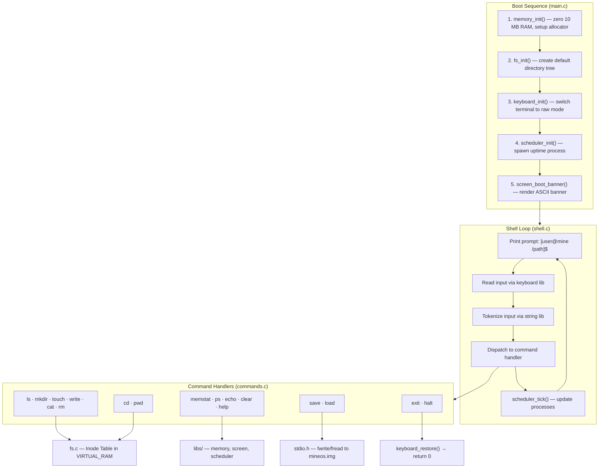
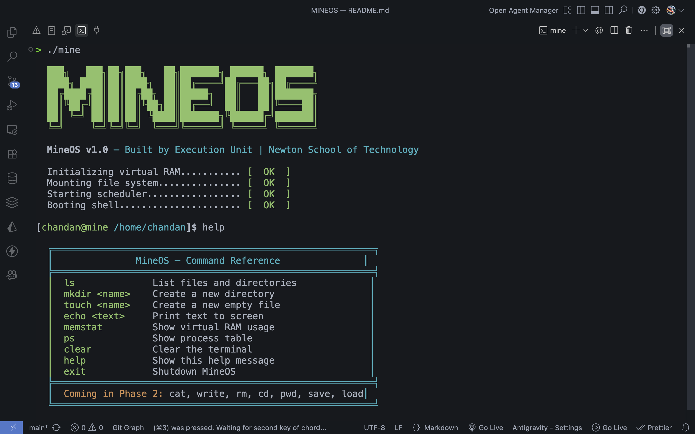
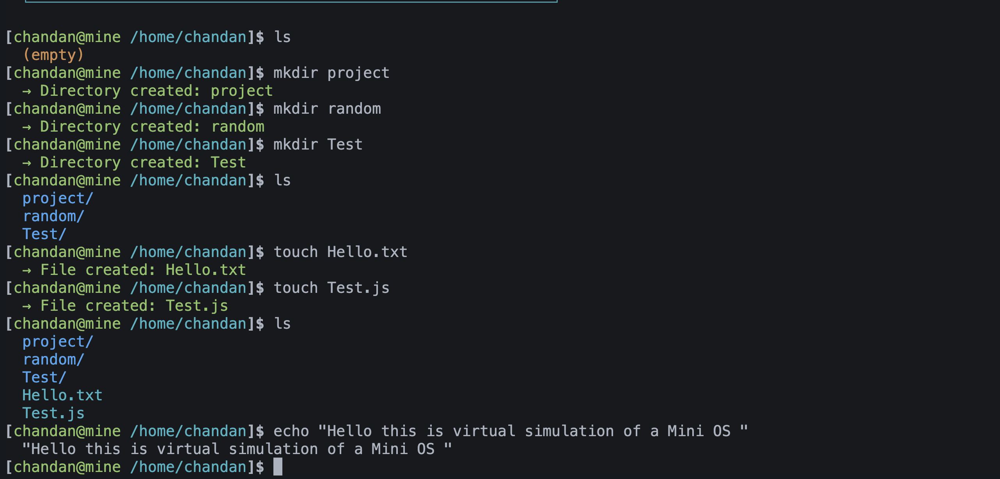
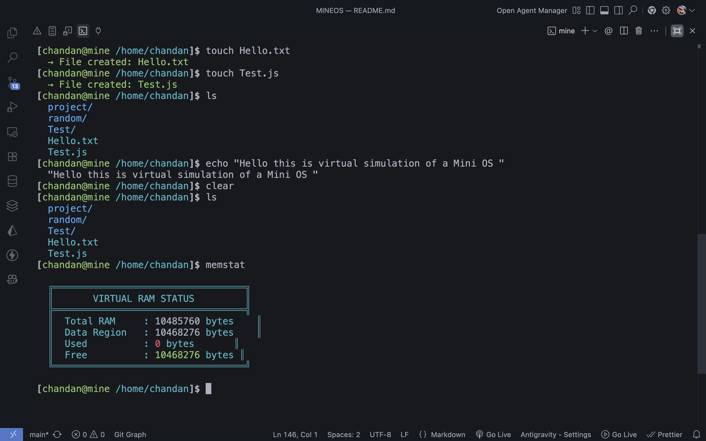
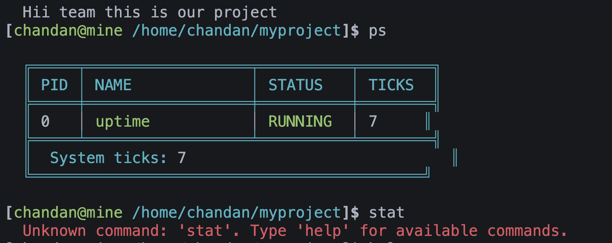
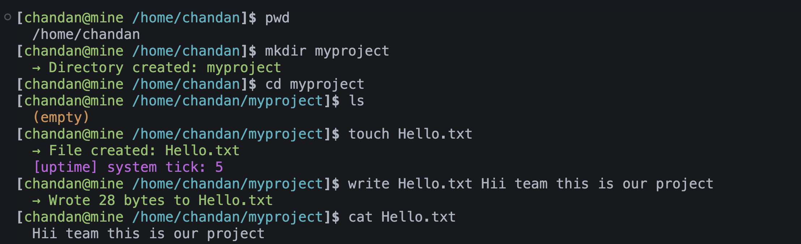
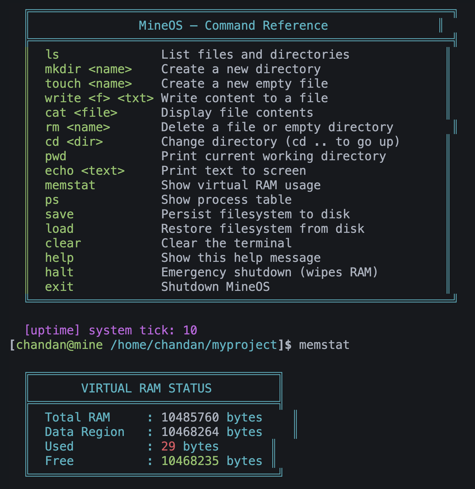

<div align="center">
  <h1>🖥️ MineOS</h1>
  <p><b>A dependency-free Virtual Operating System built from scratch in C99.</b></p>

  [](https://en.wikipedia.org/wiki/C99)
  []()
  []()
  []()
</div>

---

## Project Description

MineOS is a Unix-like virtual operating system that runs inside a terminal. It simulates fundamental OS components — RAM, a file system, a process scheduler, and an interactive shell — **without using any standard C library** (`<stdio.h>`, `<stdlib.h>`, `<string.h>` are all replaced by hand-written equivalents).

Five custom libraries (`libs/`) handle low-level work (memory allocation, string ops, screen output, keyboard input, math), and four core modules (`core/`) implement the OS-level logic (shell, commands, filesystem, scheduler).

> **Exception:** `<stdio.h>` is used **only** for `fopen`/`fwrite`/`fread`/`fclose` in the `save` and `load` commands (disk persistence).

---

## Project Structure

```text
MINEOS/
├── main.c              ← Entry point — boot sequence
├── Makefile            ← Build system (gcc, C99)
│
├── libs/               ← Custom replacements for standard C
│   ├── memory.c/.h     ← 10 MB virtual RAM, first-fit allocator (replaces malloc/free)
│   ├── string.c/.h     ← strcpy, strcmp, strlen, tokenizer (replaces <string.h>)
│   ├── screen.c/.h     ← ANSI terminal output (replaces printf)
│   ├── keyboard.c/.h   ← Raw-mode keystroke capture via termios
│   └── math.c/.h       ← Bounds checking, arithmetic helpers
│
├── core/               ← OS logic
│   ├── shell.c/.h      ← Interactive prompt loop
│   ├── commands.c/.h   ← Dispatcher + all 17 command implementations
│   ├── fs.c/.h         ← Inode-based virtual file system
│   └── scheduler.c/.h  ← Tick-based process table in virtual RAM
│
├── Assets/             ← Screenshots and demo images
└── mineos.img          ← Auto-generated filesystem snapshot (via save)
```

---

## System Architecture

The diagram below shows the boot sequence and how a user command flows through the system.



### Virtual RAM Layout (10 MB)

```text
┌──────────────────────────────────────────┐ ← Offset 0
│  RAM Header (64 bytes)                   │
├──────────────────────────────────────────┤ ← Offset 64
│  Inode Table                             │
│  128 slots × 128 bytes = 16,384 bytes    │
├──────────────────────────────────────────┤ ← Offset 16,448
│  Process Table                           │
│  16 slots × 64 bytes = 1,024 bytes       │
├──────────────────────────────────────────┤ ← Offset 17,472
│  Data Block Region                       │
│  ~10.48 MB of dynamic free space         │
│  Managed by alloc() / dealloc()          │
│  Uses linked-list of BlockHeaders        │
└──────────────────────────────────────────┘ ← Offset 10,485,760
```

---

## User Controls / Commands

| Command | Usage | Description |
|---|---|---|
| `ls` | `ls` | List files and directories in current directory |
| `mkdir` | `mkdir <name>` | Create a new directory |
| `touch` | `touch <name>` | Create a new empty file |
| `write` | `write <file> <text>` | Write content to a file (allocates data block) |
| `cat` | `cat <file>` | Display file contents |
| `rm` | `rm <name>` | Delete a file or empty directory |
| `cd` | `cd <dir>` / `cd ..` / `cd /` / `cd` | Change directory (no args = home) |
| `pwd` | `pwd` | Print current working directory path |
| `echo` | `echo <text>` | Print text to screen |
| `memstat` | `memstat` | Show virtual RAM usage (total, used, free) |
| `ps` | `ps` | Show process table (PID, name, status, ticks) |
| `save` | `save` | Persist entire filesystem to `mineos.img` |
| `load` | `load` | Restore filesystem from `mineos.img` |
| `clear` | `clear` | Clear the terminal screen |
| `help` | `help` | Show built-in command reference |
| `halt` | `halt` | Emergency shutdown — wipes RAM and exits |
| `exit` | `exit` | Graceful shutdown |

---

## How to Build and Run

### Prerequisites

- **gcc** (any version supporting C99)
- A Unix-like terminal (macOS / Linux)

### Steps

```bash
# 1. Clone the repository
git clone https://github.com/<your-username>/MINEOS.git
cd MINEOS

# 2. Compile and run in one step
make run

# 3. You are now inside MineOS — try: ls, mkdir test, touch file.txt, help

# 4. Exit the OS
exit

# 5. Clean build artifacts
make clean
```

**What `make run` does:**  
Compiles all `.c` files in `libs/` and `core/` with `gcc -Wall -Wextra -std=c99 -g`, links them into a `./mine` binary, and immediately runs it.

---

## Demo Evidence

### Phase 1 Screenshots

> 
> **Screenshot 1 — Boot Sequence:** MineOS boots with an ASCII banner rendered entirely through `screen.c`, initializes RAM, mounts the filesystem, starts the scheduler, and drops into the shell.

<br>

> 
> **Screenshot 2 — Shell Commands:** Demonstrates `ls`, `mkdir`, `touch`, and `echo` working in the interactive shell. Directories show in blue, files in cyan.

<br>

> 
> **Screenshot 3 — Memory Statistics:** The `memstat` command shows the custom allocator's state — 10 MB total RAM, with the data region tracked by the first-fit block allocator.

<br>

### Phase 2 Screenshots

<!-- 
    ┌──────────────────────────────────────────────────────────────────┐
    │  PHASE 2 DEMO IMAGES — Add screenshots here when available     │
    │                                                                  │
    │  Suggested captures:                                             │
    │    1. write + cat  → writing to a file and reading it back       │
    │    2. cd + pwd     → navigating directories, pwd showing path    │
    │    3. rm           → deleting a file, then ls to confirm         │
    │    4. save + load  → persisting and restoring across reboots     │
    │    5. ps           → process table with uptime ticking           │
    │    6. halt         → emergency shutdown wiping RAM               │
    └──────────────────────────────────────────────────────────────────┘
-->

> **Screenshot 4 — File Read/Write (Phase 2):**
> _📷 Image placeholder — add screenshot of `write` + `cat` commands here_
>
> 

<br>

> **Screenshot 5 — Directory Navigation (Phase 2):**
> _📷 Image placeholder — add screenshot of `cd` + `pwd` commands here_
>
> 

<br>

> **Screenshot 6 — Persistence & Process Table (Phase 2):**
> _📷 Image placeholder — add screenshot of `save`/`load` + `ps` commands here_
>
> 

---

## Known Issues

| # | Issue | Severity | Details |
|---|---|---|---|
| 1 | **Inode IDs are never recycled** | Medium | `next_inode_id` only increments. Deleting files with `rm` marks inodes inactive but the ID slot is not reused. After 128 creates, no more files/dirs can be made (until reboot). |
| 2 | **`write` overwrites, no append** | Low | `write` replaces the entire file content each time. There is no append mode. |
| 3 | **Directory max children = 16** | Low | Each directory can hold at most 16 children (`MAX_CHILDREN`). Exceeding this prints an error. |
| 4 | **`rm` cannot delete non-empty directories** | By Design | You must manually remove all children before removing a directory. No recursive delete. |
| 5 | **`save`/`load` dumps entire 10 MB** | Low | The `mineos.img` file is always 10 MB regardless of actual usage. No compression or delta saves. |
| 6 | **No tab completion or arrow-key history** | Low | The raw-mode keyboard driver supports backspace and enter, but not arrow keys or tab completion. |
| 7 | **Single-user, single-session** | By Design | No multi-user support or concurrent sessions. One shell loop runs until exit. |
| 8 | **Command name max 32 chars** | Low | Input validation rejects commands longer than 32 characters as a safety measure. |

---
