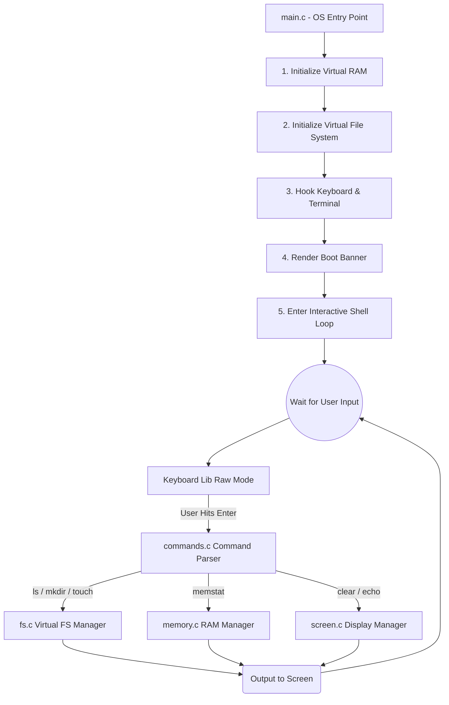

<div align="center">
  <h1>🚀 MineOS</h1>
  <p><b>A purely custom, dependency-free Virtual Operating System built entirely in C99.</b></p>

  [](https://en.wikipedia.org/wiki/C99)
  []()
  []()
</div>

<br>

## 📖 Table of Contents
- [About the Project](#-about-the-project)
- [System Architecture Flow](#-system-architecture-flow)
- [The "No Standard C Library" Philosophy](#-the-no-standard-c-library-philosophy)
- [Directory Structure](#-directory-structure)
- [How to Setup Locally](#-how-to-setup-locally)
- [Demo Showcase](#-demo-showcase)
- [Guide for Evaluators](#-guide-for-evaluators)

---

## 🎯 About the Project

MineOS is a phase-based project aimed at building a Unix-like virtual operating system from scratch inside a terminal space. 

Instead of relying on heavy existing frameworks or even the standard C libraries, MineOS simulates its fundamental building blocks (RAM, disk operations, standard IO, string manipulations) all on its own. It boots up, hooks into the keyboard directly, loads a custom virtual file system, and provides an interactive shell for the user to execute commands.

---

## 🏗️ System Architecture Flow

Here is a high-level representation of how MineOS boots gracefully and processes inputs. The architecture separates the underlying basic operations (`libs/`) from the system-level functions (`core/`).



---

## 🚫 The "No Standard C Library" Philosophy

One of the strict constraints of MineOS is that we do **not** use standard libraries like `<stdio.h>`, `<stdlib.h>`, or `<string.h>` for core application logic. 

We built **five foundational custom libraries** inside the `libs/` directory to simulate standard hardware behaviour and C utilities:

1. 🧮 **`math.c`**: Handles low-level numeric/computational bounds checking and mathematical algorithms usually provided by the system.
2. 🔠 **`string.c`**: A complete rewrite of standard string parsers. Since shells rely heavily on splitting space-separated arguments, we implemented custom `strcpy`, `strcmp`, `strlen`, and `strtok`.
3. 💾 **`memory.c`**: Replaces `malloc`/`free`. We simulate an isolated "RAM block" mapping used by processes and file system nodes.
4. 🖥️ **`screen.c`**: Replaces `printf`. This library bridges pure bytes onto the terminal using customized ANSI escape tracking, clearing the screen natively, and rendering visual borders.
5. ⌨️ **`keyboard.c`**: We bypass standard buffered input (where you have to press Enter before C reads keys). We hook directly into the terminal's `termios` to enable raw-mode keystroke capturing.

---

## 📂 Directory Structure

```text
MINEOS/
│
├── main.c           # OS Entry point. Initializes hardware simulators and jumps to shell.
├── Makefile         # Build pipeline for compiling system modules.
│
├── core/            # The "Operating System" Logic
│   ├── commands.c/h # Maps shell text to kernel actions (e.g. 'echo', 'mkdir').
│   ├── fs.c/h       # High-level virtual file system controller.
│   ├── scheduler.c/h# CPU task/process queue simulator.
│   └── shell.c/h    # The infinite prompt loop.
│
└── libs/            # Hardware abstraction and base C utilities
    ├── keyboard.c/h # Directly intercepts keystrokes via RAW terminal mode.
    ├── math.c/h     # Low-level mathematical logic operations.
    ├── memory.c/h   # OS Virtual RAM setup and chunk allocation.
    ├── screen.c/h   # Handles direct-to-buffer screen painting.
    └── string.c/h   # Custom string operations.
```

---

## 🚀 How to Setup Locally

Running MineOS is incredibly simple. You only need `gcc` installed on your machine.

**1. Clone the repository / Navigate to directory**
```bash
cd MINEOS
```

**2. Compile and Boot**
Using the integrated `Makefile`, you can quickly compile all nodes and execute the OS.
```bash
make run
```
**(This command compiles `.c` files into `mine` executable, and immediately runs `./mine`)*.*

**3. Cleanup Build Files**
To clean up object `.o` files and binaries:
```bash
make clean
```

---

## 📸 Demo Showcase

Here is a visual demonstration of MineOS in action:

>  
> *Image 1:* The beautiful boot sequence banner generated directly via `screen.c`, bypassing `stdio` buffering, launching immediately upon executing `./mine`.

<br>


>  
> *Image 2:* The interactive shell looping. Notice the utilization of the commands like `ls` and `mkdir` communicating smoothly with the locally simulated RAM space in `fs.c`.

<br>


>  
> *Image 3:* Using the `memstat` command, evaluating how our custom `memory.c` allocates specific blocks rather than relying on system-level `malloc`.


---

